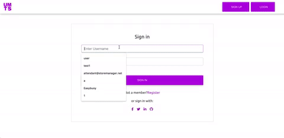

# Use My Tech Stuff

Use My Tech Stuff aims to provide a safe, guaranteed, and efficient way to effortlessly share professional tech equipment.
 

 
<code>

<h3>Link to Marketing Page: https://naughty-feynman-cff292.netlify.com/</h3>

<h3>Link to Application: https://ls-umts.netlify.com/</h3>

<h3>Link to API: https://usemytechstuffbe.herokuapp.com/api/auth/ </h3>

</code>
 

### Table Of Contents

- <a href="#built-with">Built With</a>
- <a href="#getting-started">Getting Started</a>
- <a href="#contributors">Contributors</a>
   

## Built With

<ul>
<li><a href="https://reactjs.org">React</a></li>
<li><a href="https://redux.js.org/">Redux</a></li>
<li><a href="https://mdbootstrap.com">Material Design Bootstrap</a></li>
<li><a href="styled-components.com/">Styled Components</a></li>
</ul>

## Getting Started

<h3>Prerequisites</h3>
You need Nodejs Installed to be able to run this project on your machine.

<h3>Installing<h3>
<ul><li>Clone Repository</li></ul>
<pre><code>git clone https://github.com/use-my-tech-6-24/useMyTech-FE</code> </pre>
 
 

<ul><li>Change Directory To Store Manager</li></ul>
<pre><code>cd useMyTech-FE</code></pre>
 
 

<ul><li>Install Dependencies</li></ul>
<pre><code>npm install</code></pre>
 
 

<ul><li>Start Application</li></ul>
<pre><code>npm run start</code></pre>
 
 

## Contributors

Frontend 

Frontend 

 

Backend 

 

User-Interface 

 

User-Interface 

 

User-Interface 

 

UI/UX 

 

Team Lead 

